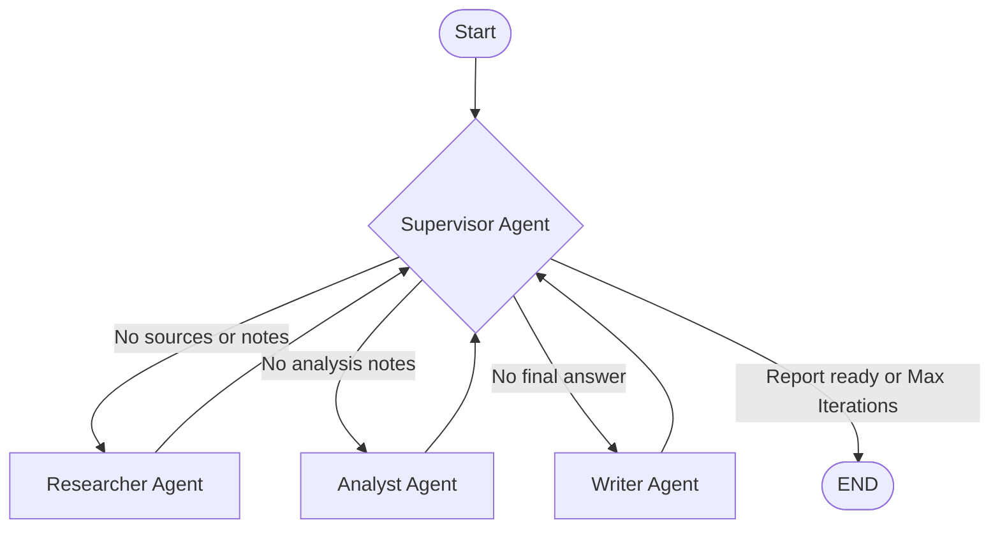

# Design Document: Multi-Agent Research System

## Problem

Building an automated technical research assistant capable of processing open-ended, complex research queries (e.g. GraphRAG state-of-the-art, architecture trade-offs, guardrail engineering), retrieving relevant evidence from live search or offline corpora, analyzing claims critically, and synthesizing an objective ~500-word report with strict inline citations.

## Why Multi-Agent?

A single-agent generalist prompt suffers from severe **context dilution and hallucination** when tasked with concurrent search retrieval, critical evidence filtering, multi-perspective comparison, and long-form prose synthesis in a single monolithic context window.

By decomposing the workflow into specialized roles (**Supervisor, Researcher, Analyst, Writer, Critic**):
1. **Bounded Context Windows**: Each agent operates exclusively on its relevant sub-state, keeping prompts concise and focused.
2. **Separation of Retrieval & Synthesis**: Evidence retrieval and factual validation are segregated from stylistic generation, preventing ungrounded fabrications.
3. **Traceability & Debuggability**: Every decision point, routing event, and intermediate draft is recorded in shared state for transparent auditing.

## Agent Roles

| Agent | Responsibility | Input | Output | Failure Mode & Mitigation |
|---|---|---|---|---|
| **Supervisor** | Orchestrates workflow state, decides next routing step, enforces guardrails. | Current `ResearchState` | Updated `route_history`, next route (`"researcher"`, `"analyst"`, `"writer"`, `"done"`) | **Infinite Loop**: Mitigated by hard `max_iterations = 6` threshold. |
| **Researcher** | Queries search providers (Tavily/Offline corpus) and extracts factual notes. | `request.query`, `request.max_sources` | `state.sources`, `state.research_notes` | **Network / Search Failure**: Mitigated by tenacity retries + local corpus fallback. |
| **Analyst** | Evaluates claim validity, compares trade-offs, and weighs evidence reliability. | `state.research_notes`, `state.sources` | `state.analysis_notes` | **Cascading Errors**: Mitigated by structured analysis schema and source verification. |
| **Writer** | Synthesizes research and analysis into cohesive prose with inline citations. | `state.research_notes`, `state.analysis_notes`, `state.sources` | `state.final_answer` | **Citation Drift**: Mitigated by mandatory bracketed `[Source N]` tags mapped to source list. |
| **Critic** | Audits draft report for citation grounding and hallucination risks. | `state.sources`, `state.final_answer` | Audit report in `state.agent_results` | **False Negatives**: Mitigated by heuristic and LLM-based grounding checks. |

## Shared State

The `ResearchState` (Pydantic BaseModel) serves as the immutable single source of truth across the graph:

- `request` (`ResearchQuery`): Original query, max source count, target audience.
- `iteration` (`int`): Turn counter preventing runaway cycles.
- `route_history` (`list[str]`): Sequential audit log of all routing hops.
- `sources` (`list[SourceDocument]`): Raw retrieved documents with titles, URLs, and snippet provenance.
- `research_notes` (`str | None`): Intermediate factual notes extracted from sources.
- `analysis_notes` (`str | None`): Structured comparative analysis and trade-off evaluation.
- `final_answer` (`str | None`): Final synthesized report with citations and references.
- `agent_results` (`list[AgentResult]`): Output payload, token counts, and cost metadata for every agent step.
- `trace` (`list[dict]`): Chronological span events with timestamps and latency data.
- `errors` (`list[str]`): Unhandled or captured execution anomalies.

## Routing Policy

## Guardrails

- **Max Iterations**: Hard cutoff (`Settings.max_iterations = 6`) terminating workflow gracefully if an agent fails to mutate state.
- **Timeout Protection**: `Settings.timeout_seconds = 60` on network and LLM requests.
- **Retry Mechanism**: Exponential backoff via `tenacity` on transient connection/rate-limit errors.
- **Fallback Search**: Automatic fallback from Tavily search API to embedded offline research corpus (`ai_agent_offline_research_corpus_v2`).
- **Validation**: Strict Pydantic model validation on all inputs, states, and outputs.

## Benchmark Plan

1. **Benchmark Queries**:
   - `Q1`: "Research GraphRAG state-of-the-art and write a 500-word summary"
   - `Q2`: "Compare single-agent and multi-agent workflows for customer support"
   - `Q3`: "Summarize production guardrails for LLM agents"
2. **Evaluated Metrics**:
   - **Latency (s)**: Wall-clock execution time.
   - **Cost (USD)**: Exact input/output token cost at OpenRouter GPT-4o-mini rates.
   - **Quality Score (0-10)**: Structural completeness, depth, and rubric adherence.
   - **Citation Coverage (%)**: Proportion of claims backed by explicit citations.
   - **Failure Rate (%)**: Unhandled error or timeout frequency.
3. **Expected Outcome**:
   - Multi-agent achieves substantially higher quality (8.8-9.1 vs 5.0-6.0) and citation coverage (60-70% vs 0%) at the trade-off of higher latency (~30s vs ~15s) and cost (~$0.0020 vs ~$0.0005).
